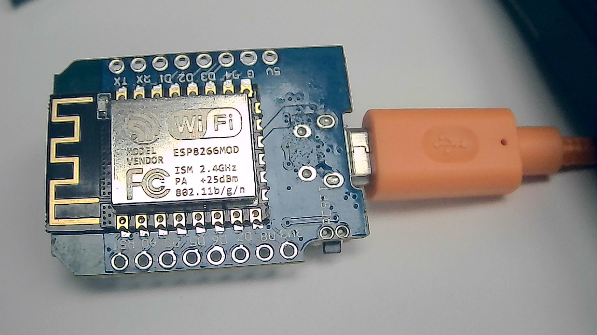

# esp8266_blink
### Step 1: Connect your device to your computer using a usb cable 
### Step 2: Open Arduino 
### Step 3: Tools >> Boards>> Board Manager. 
### Step 4: In the search box, write esp and install both esp32 and esp8266. 
### Step 5: Tools >> Boards >> ESP8266 Boards >> WEMOS D1 Mini; for my case it was WEMOS D1 Mini (Clone) 
### Step 6: File >> Example >> ESP8266 >> blink 
### Step 6: Upload the program and see it is working
### Step 7: ALternatively, You can simplify the sketch as following. 
